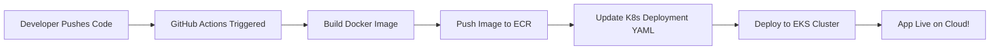

# 🌌 SkyKube

**SkyKube** is a cloud-native project designed to demonstrate end-to-end DevOps practices using **AWS, Terraform, Docker, Kubernetes, and CI/CD automation**.  
The project is divided into two repositories:  

- **[SkyKube-Infra](https://github.com/gursimran531/SkyKube-Infra.git)** — Contains all Infrastructure as Code (IaC) components built with Terraform (VPC, EKS, ECR, S3, Lambda, Route 53, CloudFront, IAM, etc.).  
- **[SkyKube-App](https://github.com/gursimran531/SkyKube-App.git)** — Contains the application source code, Kubernetes manifests, and GitHub Actions workflow for automated CI/CD deployment to AWS EKS.

---

## 🧩 Repository Overview — SkyKube-App

This repository holds the **frontend and application deployment logic** for the SkyKube project.  
It demonstrates how containerized applications can be automatically built, pushed, and deployed to a running **EKS cluster** using **GitHub Actions**.

### 🗂️ Repository Structure

```
SkyKube-App/
├── k8s/
│   ├── deployment.yaml     # Kubernetes Deployment manifest
│   ├── service.yaml        # Kubernetes Service manifest
|   └── ingress.yaml
├── .github/
│   └── workflows/
│       └── deploy.yml      # GitHub Actions CI/CD pipeline
├── app/
│   ├── Dockerfile          # Docker build instructions for the app
│   ├── index.js            
|   ├── package.json
|   └── public/
│       └── index.html  
└── README.md               # Project documentation
```

---

## ⚙️ How It Works

1. **Docker Build & Push**  
   Every time code is pushed to the `main` branch, GitHub Actions:
   - Builds a Docker image using the `Dockerfile`
   - Tags the image with the GitHub SHA (unique commit ID)
   - Pushes the image to **Amazon ECR**

2. **Automatic EKS Deployment**  
   Once the image is built and uploaded:
   - The workflow updates the Kubernetes manifest with the new image name:
     ```bash
     sed -i "s|image: .*|image: ${{ env.image }}|" k8s/deployment.yaml
     ```
   - Applies the manifests to the EKS cluster:
     ```bash
     kubectl apply -f k8s/
     ```
   - Waits for rollout completion:
     ```bash
     kubectl rollout status deployment skykube-deployment
     ```

3. **AWS EKS Integration**  
   The workflow connects to the EKS cluster using:
   ```bash
   aws eks update-kubeconfig --region us-east-1 --name SkyKube-cluster
   ```
   This ensures the deployment targets the correct environment.

---

## 🚀 GitHub Actions CI/CD Pipeline

### Workflow Highlights
- **Trigger:** On every push to `main`
- **Builds & pushes Docker image** to AWS ECR
- **Updates Kubernetes deployment** automatically
- **Rolls out** changes to the EKS cluster

### Example Workflow Snippet
```yaml
- name: Update kubeconfig
  run: aws eks update-kubeconfig --region us-east-1 --name SkyKube-cluster

- name: Deploy to EKS
  run: |
    sed -i "s|image: .*|image: ${{ env.image }}|" k8s/deployment.yaml
    kubectl apply -f k8s/
    kubectl rollout status deployment skykube-deployment
```

---

## 🧱 Technologies Used
- **AWS EKS (Elastic Kubernetes Service)** — container orchestration
- **AWS ECR (Elastic Container Registry)** — image storage
- **Docker** — containerization
- **Kubernetes** — deployment and scaling
- **GitHub Actions** — CI/CD automation
- **Terraform** *(via [SkyKube-Infra](https://github.com/gursimran531/SkyKube-Infra.git))* — infrastructure provisioning

---

## 📦 Deployment Flow Summary



---

## 🌐 Related Repository

🔗 **[SkyKube-Infra](https://github.com/gursimran531/SkyKube-Infra.git)**  
Contains Terraform scripts to provision:
- VPC, Subnets, Security Groups  
- EKS Cluster & Node Groups  
- ECR Repository  
- S3 Bucket (for static hosting and voice notes)  
- Lambda Functions & IAM Roles  
- Route 53 Domain and CloudFront CDN

---

## 🧠 Future Improvements
- Integrate Ansible for configuration management  
- Add monitoring via Prometheus + Grafana  

---

## Notes
- Once the infrastructure is created, you’ll need to deploy the application so that the ALB (Application Load Balancer) is provisioned. After that, you can use the ALB’s DNS name when setting up CloudFront to ensure proper routing. I also encountered a few issues related to security group configurations during this process that I had to manually allow traffic from alb sg to node group sg — any suggestions or improvements would be greatly appreciated.

---

## 👤 Author
**Gursimran Singh**  
AWS Certified Cloud & DevOps Engineer  
📧 [LinkedIn Profile](https://www.linkedin.com/in/gursimran-singh-269ba5224/)
